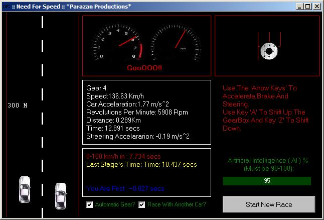



## Need For Speed v2

### Description

This racing game has it all.Good Gameplay,good gearbox system and collision detection rules,speedometer , RPM-meter and gearbox displays.You can run with the computer Or against the time.Accelerations(m/s^2),speeds(Km/h),distances(Km) and times(secs) are the same with these of a car in the real world and you can edit the gearbox's information.You can also edit the AI-Level.Enjoy!
 
### More Info
 

             |
---                |---
**Submitted On**   |2007-04-02 05:52:52
**By**             |[garz0r7](https://github.com/Planet-Source-Code/PSCIndex/blob/master/ByAuthor/garz0r7.md)
**Level**          |Beginner
**User Rating**    |4.2 (21 globes from 5 users)
**Compatibility**  |VB 6\.0
**Category**       |[Games](https://github.com/Planet-Source-Code/PSCIndex/blob/master/ByCategory/games__1-38.md)
**World**          |[Visual Basic](https://github.com/Planet-Source-Code/PSCIndex/blob/master/ByWorld/visual-basic.md)
**Archive File**   |[Need\_For\_S2060354152007\.zip](https://github.com/Planet-Source-Code/garz0r7-need-for-speed-v2__1-68229/archive/master.zip)

